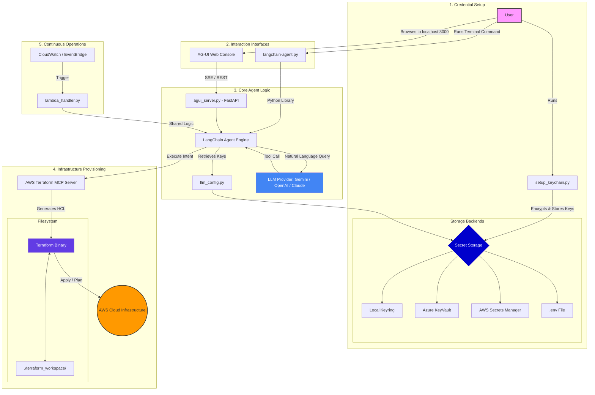

# Application Architecture 🏗️

This document describes the high-level architecture of the AWS Infrastructure Agent Bot, illustrating the flow from credential setup to multi-interface interaction and automated infrastructure provisioning.

## 🗺️ System Overview

## 🔍 Component Descriptions

| Component | Responsibility |
| :--- | :--- |
| **`setup_keychain.py`** | Securely captures LLM API keys and stores them in your preferred vault (Keyring, AWS, Azure). |
| **`llm_config.py`** | Central engine for provider mapping and multi-source credential retrieval. |
| **`agui_server.py`** | FastAPI backend that manages chat sessions and streams responses via Server-Sent Events (SSE). |
| **`langchain-agent.py`** | The CLI interface that provides the exact same infrastructure logic in a terminal environment. |
| **`aws_terraform_server.py`** | The MCP server that translates LLM intents into real Terraform code and manages the deployment lifecycle. |
| **`lambda_handler.py`** | Wraps the agent logic into a serverless function for remote triggers or API integration. |
| **`terraform_workspace/`** | The directory where the agent generates, manages, and tracks the state of your infrastructure. |
