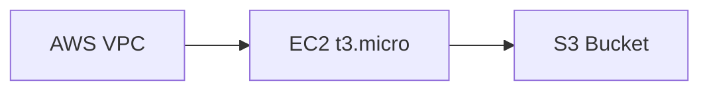

# Architecture-Driven Infrastructure Deployment - Documentation Index

## Quick Navigation

### 🚀 Getting Started
1. **[QUICK_START_ARCHITECTURE_DEPLOYMENT.md](docs/QUICK_START_ARCHITECTURE_DEPLOYMENT.md)** - Start here!
   - Installation and setup
   - Basic usage examples
   - API endpoint overview
   - First deployment walkthrough

### 📚 Complete Guides
2. **[docs/ARCHITECTURE_DRIVEN_DEPLOYMENT.md](docs/ARCHITECTURE_DRIVEN_DEPLOYMENT.md)** - Comprehensive user guide
   - Detailed API documentation
   - Mermaid diagram examples
   - Supported AWS services
   - Troubleshooting guide

3. **[ARCHITECTURE_DEPLOYMENT_IMPLEMENTATION.md](docs/ARCHITECTURE_DEPLOYMENT_IMPLEMENTATION.md)** - Technical deep dive
   - Implementation details
   - Component overview
   - Security considerations
   - Future enhancements

4. **[SYSTEM_ARCHITECTURE.md](docs/SYSTEM_ARCHITECTURE.md)** - Architecture diagrams
   - System architecture diagram
   - Data flow diagrams
   - Component interactions
   - Technology stack

### 🔍 Implementation Details
5. **[IMPLEMENTATION_CHECKLIST.md](docs/IMPLEMENTATION_CHECKLIST.md)** - What was built
   - Complete checklist of features
   - All supported AWS services
   - Testing information
   - Performance considerations

### 💻 Code Examples
6. **[samples/architecture_deployment_examples.py](samples/architecture_deployment_examples.py)** - Python examples
   - Parse Mermaid diagrams
   - Parse architecture images
   - Generate Terraform
   - Deploy infrastructure

7. **[ui/architecture-deployment.js](ui/architecture-deployment.js)** - JavaScript library
   - Frontend API client
   - UI components
   - Ready-to-use functions
   - HTML integration examples

### 📝 Implementation Files
8. **[core/architecture_parser.py](core/architecture_parser.py)** - Core module
   - ArchitectureParser class
   - Mermaid parsing logic
   - Image analysis
   - Terraform generation

9. **[bin/agui_server.py](bin/agui_server.py)** - AGUI server (updated)
   - 4 new REST endpoints
   - File upload handling
   - LLM integration

10. **[mcp_servers/aws_terraform_server.py](mcp_servers/aws_terraform_server.py)** - MCP server (updated)
    - 3 new tools for agents
    - Tool handlers
    - Integration with Terraform

## Feature Overview

### What It Does
The system allows you to:

```
┌─────────────────────────────────────────┐
│  1. Upload architecture diagram/image   │
│     (Mermaid or PNG/JPG/GIF/WebP)      │
└────────────────────┬────────────────────┘
                     ↓
        ┌────────────────────────────┐
        │  2. System analyzes it     │
        │  (Vision API or regex)     │
        └────────────┬───────────────┘
                     ↓
        ┌────────────────────────────┐
        │  3. Generate Terraform     │
        │  (LLM-powered)             │
        └────────────┬───────────────┘
                     ↓
        ┌────────────────────────────┐
        │  4. Deploy to AWS          │
        │  (One-click or manual)      │
        └────────────────────────────┘
```

### Supported Inputs
- **Mermaid Diagrams** - Text-based architecture descriptions
- **Architecture Images** - PNG, JPG, GIF, WebP diagrams
- **JSON Architecture** - Direct API usage

### Supported Outputs
- **Terraform Code** - Production-ready HCL
- **AWS Infrastructure** - 30+ service types
- **Deployment Plans** - Ready for review and apply

## Key Concepts

### 1. Mermaid Architecture Syntax


### 2. Image Analysis
Upload a screenshot or diagram of your AWS architecture → System extracts resources using AI vision

### 3. Terraform Generation
Extracted resources → LLM generates complete, production-ready Terraform code

### 4. One-Click Deploy
Architecture → Plan ready for terraform apply in seconds

## API Reference

### Endpoints

| Endpoint | Method | Purpose |
|----------|--------|---------|
| `/api/architecture/parse-mermaid` | POST | Parse Mermaid diagram |
| `/api/architecture/parse-image` | POST | Analyze architecture image |
| `/api/architecture/generate-terraform` | POST | Generate Terraform code |
| `/api/architecture/deploy` | POST | One-shot: Generate + Plan |

### MCP Tools

| Tool | Purpose |
|------|---------|
| `parse_mermaid_architecture` | Extract from Mermaid text |
| `generate_terraform_from_architecture` | Convert to Terraform |
| `deploy_architecture` | Generate + Plan |

## Supported AWS Services (30+)

**Compute**
- EC2, Lambda, ECS, Batch

**Storage**
- S3, EBS, EFS, Glacier

**Database**
- RDS, DynamoDB, ElastiCache, Redshift

**Network**
- VPC, Subnets, Security Groups, NAT, CloudFront, API Gateway

**Load Balancing**
- ELB, ALB, NLB

**Integration**
- SQS, SNS, Kinesis, EventBridge

**Security**
- IAM, KMS, ACM, Security Groups

**Monitoring**
- CloudWatch, CloudTrail, X-Ray

## Usage Examples

### Example 1: Mermaid Text
```bash
curl -X POST http://localhost:9595/api/architecture/parse-mermaid \
  -H "Content-Type: application/json" \
  -d '{"mermaid": "graph LR\n  VPC --> EC2\n  EC2 --> S3"}'
```

### Example 2: Image Upload
```bash
curl -F "file=@architecture.png" \
  http://localhost:9595/api/architecture/parse-image
```

### Example 3: Deploy
```bash
curl -X POST http://localhost:9595/api/architecture/deploy \
  -H "Content-Type: application/json" \
  -d '{"architecture": {...}}'
```

### Example 4: Python
```python
from core.architecture_parser import ArchitectureParser

parser = ArchitectureParser()
arch = parser.parse_mermaid_diagram("graph LR...")
terraform = parser.architecture_to_terraform(arch)
```

### Example 5: JavaScript
```javascript
const arch = await parseArchitectureMermaid("graph LR...");
const result = await deployArchitecture(arch);
```

## Workflow Examples

### Scenario 1: Simple 3-Tier Web App
1. Draw architecture in draw.io
2. Export as PNG
3. Upload to `/api/architecture/parse-image`
4. Review extracted resources
5. Call `/api/architecture/deploy`
6. Run `terraform apply`
7. Enjoy your infrastructure!

### Scenario 2: Microservices
1. Write Mermaid diagram
2. Send to `/api/architecture/parse-mermaid`
3. Get Terraform code
4. Customize as needed
5. Deploy with `/api/architecture/deploy`

### Scenario 3: Agent-Based
1. Agent receives deployment request
2. Creates Mermaid diagram
3. Calls `parse_mermaid_architecture` MCP tool
4. Calls `deploy_architecture` MCP tool
5. Monitors terraform progress
6. Confirms deployment

## File Structure

```
aws-infra-agent-bot/
├── core/
│   ├── architecture_parser.py          ← Core implementation
│   ├── llm_config.py
│   └── check_env.py
│
├── bin/
│   ├── agui_server.py                  ← Updated with 4 endpoints
│   └── setup_keychain.py
│
├── mcp_servers/
│   ├── aws_terraform_server.py         ← Updated with 3 tools
│   └── __init__.py
│
├── ui/
│   ├── architecture-deployment.js      ← Frontend library
│   ├── app.js
│   ├── index.html
│   └── app.css
│
├── docs/
│   ├── ARCHITECTURE_DRIVEN_DEPLOYMENT.md
│   └── ...
│
├── terraform_workspace/                ← Generated projects
│   ├── ec2_architecture/
│   ├── web_app/
│   └── ...
│
├── [QUICK_START_ARCHITECTURE_DEPLOYMENT.md](docs/QUICK_START_ARCHITECTURE_DEPLOYMENT.md)
├── [ARCHITECTURE_DEPLOYMENT_IMPLEMENTATION.md](docs/ARCHITECTURE_DEPLOYMENT_IMPLEMENTATION.md)
├── [SYSTEM_ARCHITECTURE.md](docs/SYSTEM_ARCHITECTURE.md)
├── [IMPLEMENTATION_CHECKLIST.md](docs/IMPLEMENTATION_CHECKLIST.md)
└── samples/architecture_deployment_examples.py
```

## Getting Started Steps

1. **Read** [QUICK_START_ARCHITECTURE_DEPLOYMENT.md](docs/QUICK_START_ARCHITECTURE_DEPLOYMENT.md)
2. **Run** `python bin/agui_server.py`
3. **Try** the examples in `samples/architecture_deployment_examples.py`
4. **Upload** a diagram or image
5. **Deploy** your infrastructure!

## Troubleshooting

See [QUICK_START_ARCHITECTURE_DEPLOYMENT.md](docs/QUICK_START_ARCHITECTURE_DEPLOYMENT.md#troubleshooting) for troubleshooting guide.

## Integration Points

- ✅ Works with existing LLM providers
- ✅ Uses current credential management
- ✅ Integrates with terraform workspace
- ✅ Compatible with MCP tool framework
- ✅ REST API ready for frontend integration

## Security

- No credentials stored in diagrams
- Uses AWS IAM for authentication
- Temporary files auto-cleaned
- All operations logged
- No hardcoded secrets

## Performance

- Mermaid parsing: < 100ms
- Image analysis: 1-3 seconds
- Terraform generation: 5-15 seconds
- terraform init: 10-30 seconds
- terraform plan: 10-30 seconds
- **Total time to ready-to-apply: ~80 seconds**

## Next Steps

1. Start with [QUICK_START_ARCHITECTURE_DEPLOYMENT.md](docs/QUICK_START_ARCHITECTURE_DEPLOYMENT.md)
2. Run examples to understand capabilities
3. Integrate into your UI using `ui/architecture-deployment.js`
4. Deploy your first architecture!

## Support & Documentation

- **User Guide**: `docs/ARCHITECTURE_DRIVEN_DEPLOYMENT.md`
- **Technical Details**: [ARCHITECTURE_DEPLOYMENT_IMPLEMENTATION.md](docs/ARCHITECTURE_DEPLOYMENT_IMPLEMENTATION.md)
- **Architecture Diagrams**: [SYSTEM_ARCHITECTURE.md](docs/SYSTEM_ARCHITECTURE.md)
- **Implementation Status**: [IMPLEMENTATION_CHECKLIST.md](docs/IMPLEMENTATION_CHECKLIST.md)
- **Quick Start**: [QUICK_START_ARCHITECTURE_DEPLOYMENT.md](docs/QUICK_START_ARCHITECTURE_DEPLOYMENT.md)
- **Code Examples**: `samples/architecture_deployment_examples.py` and `ui/architecture-deployment.js`

---

**Ready to deploy AWS infrastructure from architecture diagrams? Start with the Quick Start guide!**
