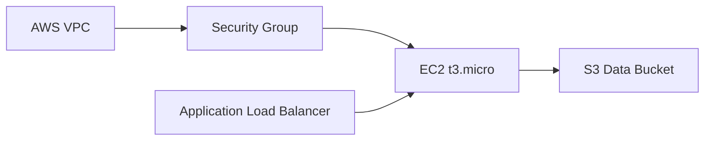
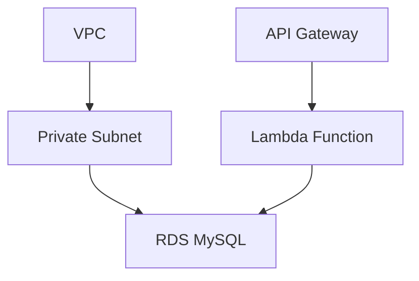
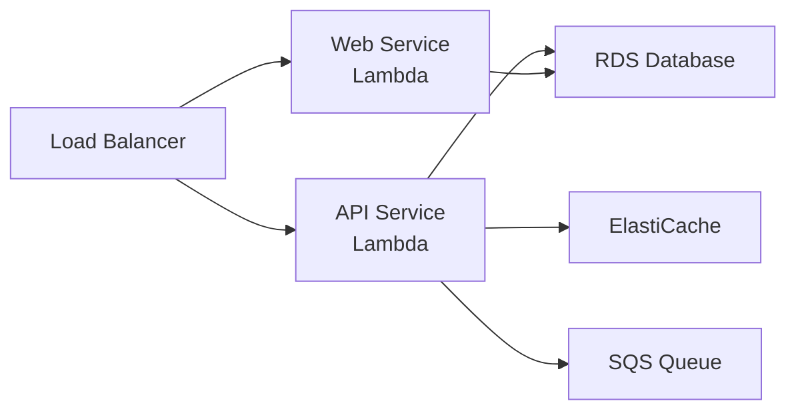
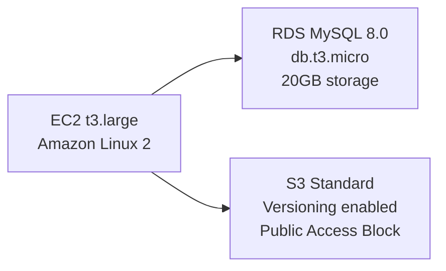

# Architecture-Driven Infrastructure Provisioning

This document explains how to use the new architecture parsing and infrastructure deployment features.

## Overview

The system now supports three ways to build AWS infrastructure:

1. **Manual Terraform** - Write Terraform code directly
2. **Mermaid Diagrams** - Describe architecture as Mermaid syntax
3. **Architecture Images** - Upload AWS architecture diagrams (PNG, JPG, GIF, WebP)

## API Endpoints

### 1. Parse Mermaid Diagram

**Endpoint:** `POST /api/architecture/parse-mermaid`

**Request:**
```json
{
  "mermaid": "graph LR\n  VPC[\"AWS VPC\"]\n  EC2[\"EC2 Instance\"]\n  S3[\"S3 Bucket\"]\n  VPC --> EC2\n  EC2 --> S3"
}
```

**Response:**
```json
{
  "type": "mermaid",
  "resources": [
    {"id": "VPC", "name": "AWS VPC", "type": "vpc", "details": {}},
    {"id": "EC2", "name": "EC2 Instance", "type": "ec2", "details": {}},
    {"id": "S3", "name": "S3 Bucket", "type": "s3", "details": {}}
  ],
  "relationships": [
    {"from": "VPC", "to": "EC2", "type": "connection"},
    {"from": "EC2", "to": "S3", "type": "connection"}
  ]
}
```

### 2. Parse Architecture Image

**Endpoint:** `POST /api/architecture/parse-image`

**Request:** Multipart form with image file

```bash
curl -F "file=@architecture.png" \
     -F "provider=claude" \
     http://localhost:9595/api/architecture/parse-image
```

**Supports:** PNG, JPG, GIF, WebP

**Query Parameters:**
- `provider` (optional): LLM provider for vision analysis (default: claude)
- `threadId` (optional): Thread ID for tracking

**Response:** Extracted resources and relationships from image

### 3. Generate Terraform from Architecture

**Endpoint:** `POST /api/architecture/generate-terraform`

**Request:**
```json
{
  "architecture": {
    "resources": [
      {"type": "ec2", "name": "web-server", "details": {"instance_type": "t3.micro"}},
      {"type": "s3", "name": "data-bucket", "details": {}}
    ],
    "relationships": [...]
  }
}
```

**Response:**
```json
{
  "success": true,
  "project_name": "ec2_architecture",
  "terraform_code": "terraform {...}",
  "message": "Terraform code generated..."
}
```

### 4. Deploy Architecture (One-Shot)

**Endpoint:** `POST /api/architecture/deploy`

**Request:**
```json
{
  "architecture": {...}
}
```

This endpoint:
1. Generates Terraform code
2. Creates project directory
3. Runs `terraform init`
4. Runs `terraform plan`
5. Returns plan ready for `terraform apply`

## Mermaid Diagram Examples

### Simple VPC with EC2 and S3



### Database Architecture



### Microservices with Multiple Services



## MCP Tools for Agents

The system also provides MCP tools for LLM agents:

### parse_mermaid_architecture

```
Tool: parse_mermaid_architecture
Parameters:
  - mermaid_content (string): Mermaid diagram syntax
```

### generate_terraform_from_architecture

```
Tool: generate_terraform_from_architecture
Parameters:
  - architecture (object): Parsed architecture dict
```

### deploy_architecture

```
Tool: deploy_architecture
Parameters:
  - architecture (object): Parsed architecture dict
```

## Workflow Examples

### Example 1: Mermaid → Terraform → Deploy

1. **Parse Mermaid:**
   ```
   User: "Here's my architecture: graph LR... VPC --> EC2 --> S3"
   Agent: Calls parse_mermaid_architecture
   Returns: Extracted resources and relationships
   ```

2. **Generate Terraform:**
   ```
   Agent: Calls generate_terraform_from_architecture with parsed architecture
   Returns: Complete Terraform code
   ```

3. **Deploy:**
   ```
   Agent: Calls terraform_plan and terraform_apply
   User gets: Running infrastructure
   ```

### Example 2: Image Upload → Deploy

1. **Upload Architecture Image:**
   ```
   User: Uploads AWS architecture diagram (PNG/JPG)
   ```

2. **Parse Image:**
   ```
   System: Uses Claude vision to analyze image
   Extracts: EC2, RDS, S3, VPC, etc.
   Returns: Architecture description
   ```

3. **Generate & Deploy:**
   ```
   System: Generates Terraform from extracted architecture
   Runs: terraform init + terraform plan
   Ready for: terraform apply
   ```

## Supported AWS Services (for Mermaid)

The parser recognizes these service keywords:
- **Compute:** EC2, Lambda, ECS, Batch
- **Storage:** S3, EBS, EFS, Glacier
- **Database:** RDS, DynamoDB, ElastiCache, Redshift
- **Network:** VPC, Subnet, NAT, VPN, CloudFront
- **Integration:** SQS, SNS, Kinesis, API Gateway
- **Monitoring:** CloudWatch, CloudTrail, X-Ray
- **Security:** IAM, KMS, ACM, Shield
- **Load Balancing:** ELB, ALB, NLB

## Advanced: Custom Prompts

For better Terraform generation, you can include details in Mermaid:



The system will incorporate these details into the generated Terraform code.

## Troubleshooting

### Vision Analysis Failures
- Ensure image is clear and readable
- Use supported formats (PNG, JPG, GIF, WebP)
- Try re-uploading with better resolution

### Terraform Generation Issues
- Verify architecture format is correct
- Check that all required fields are present
- Ensure resource types are recognized

### Deployment Failures
- Check AWS credentials are configured
- Verify IAM permissions for required services
- Review Terraform plan before applying

## Security Considerations

- All image uploads are temporary and deleted after processing
- Terraform code is generated locally
- No sensitive data is stored in architecture definitions
- Use AWS IAM roles for authentication (no hardcoded credentials)
