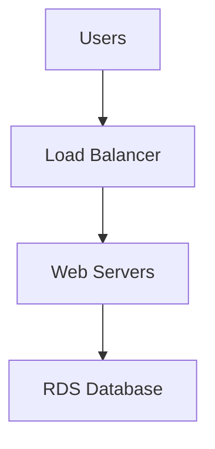
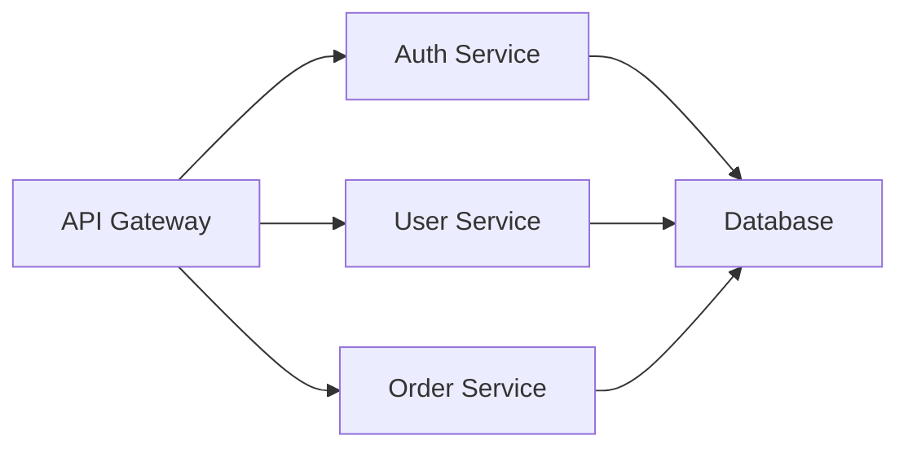
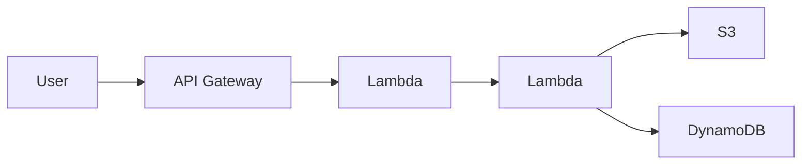

# Architecture-Driven Infrastructure Deployment - Complete Setup Guide

## Summary

You now have a complete system for deploying AWS infrastructure from:
1. **Mermaid diagrams** (text-based architecture descriptions)
2. **Architecture images** (PNG, JPG, GIF, WebP)

The system automatically generates production-ready Terraform code and can deploy it with a single command.

## Files Added

### Core Implementation
1. **`core/architecture_parser.py`** (NEW)
   - ArchitectureParser class for parsing diagrams and images
   - Supports Mermaid syntax parsing
   - Integrates with Claude vision API for image analysis
   - Generates complete Terraform configurations

### Server Enhancements
2. **`bin/agui_server.py`** (UPDATED)
   - Added 4 new REST API endpoints for architecture deployment
   - Imports and uses ArchitectureParser
   - Handles file uploads and processing
   - Integrates with MCP server for infrastructure deployment

3. **`mcp_servers/aws_terraform_server.py`** (UPDATED)
   - Added 3 new MCP tools for agents
   - parse_mermaid_architecture
   - generate_terraform_from_architecture
   - deploy_architecture

### Frontend Integration
4. **`ui/architecture-deployment.js`** (NEW)
   - JavaScript client library for frontend integration
   - React/Vue compatible components
   - Full workflow orchestration functions
   - Ready-to-use UI components

### Documentation
5. **`docs/ARCHITECTURE_DRIVEN_DEPLOYMENT.md`** (NEW)
   - Complete user guide
   - API endpoint documentation
   - Mermaid examples
   - Troubleshooting guide

6. **[ARCHITECTURE_DEPLOYMENT_IMPLEMENTATION.md](docs/ARCHITECTURE_DEPLOYMENT_IMPLEMENTATION.md)** (NEW)
   - Technical implementation details
   - Component overview
   - Architecture diagrams
   - Security considerations

### Examples & Tests
7. **`samples/architecture_deployment_examples.py`** (NEW)
   - Python examples for all workflows
   - Demonstrates Mermaid parsing
   - Shows image upload and analysis
   - Complete deployment workflows

## Quick Start

### 1. Start the AGUI Server
```bash
cd /Users/parag.kulkarni/ai-workspace/aws-infra-agent-bot
python bin/agui_server.py
```

Server runs on: `http://localhost:9595`

### 2. Test with Mermaid Diagram

```bash
curl -X POST http://localhost:9595/api/architecture/parse-mermaid \
  -H "Content-Type: application/json" \
  -d '{
    "mermaid": "graph LR\n  VPC[\"VPC\"]\n  EC2[\"EC2\"]\n  S3[\"S3\"]\n  VPC --> EC2\n  EC2 --> S3"
  }'
```

### 3. Deploy Architecture

```bash
# Parse → Generate → Plan in one call
curl -X POST http://localhost:9595/api/architecture/deploy \
  -H "Content-Type: application/json" \
  -d '{
    "architecture": {
      "resources": [
        {"type": "ec2", "name": "web-server"},
        {"type": "s3", "name": "data-bucket"}
      ],
      "relationships": [
        {"from": "web-server", "to": "data-bucket"}
      ]
    }
  }'
```

### 4. Use in Frontend

```html
<script src="ui/architecture-deployment.js"></script>

<div id="mermaid-input"></div>

<script>
  const input = new MermaidArchitectureInput('mermaid-input');
</script>
```

## API Endpoints

### Parse Mermaid Diagram
```
POST /api/architecture/parse-mermaid
```
Extracts AWS resources from Mermaid syntax.

**Request:**
```json
{
  "mermaid": "graph LR\n  VPC --> EC2"
}
```

**Response:**
```json
{
  "type": "mermaid",
  "resources": [{...}],
  "relationships": [{...}]
}
```

### Parse Architecture Image
```
POST /api/architecture/parse-image
```
Analyzes AWS architecture image using vision API.

**Request:** Form data with image file

**Response:** Extracted resources from image

### Generate Terraform
```
POST /api/architecture/generate-terraform
```
Converts architecture to Terraform code.

**Request:**
```json
{
  "architecture": {...}
}
```

**Response:**
```json
{
  "success": true,
  "project_name": "ec2_architecture",
  "terraform_code": "resource \"aws_instance\"..."
}
```

### Deploy Architecture
```
POST /api/architecture/deploy
```
One-shot deployment: Generate → Plan → Ready for apply.

**Request:**
```json
{
  "architecture": {...}
}
```

**Response:**
```json
{
  "success": true,
  "project_name": "ec2_architecture",
  "terraform_code": "...",
  "plan_result": {...}
}
```

## MCP Tools for Agents

### parse_mermaid_architecture
```
Tool: parse_mermaid_architecture
Input: {mermaid_content: "graph LR..."}
Output: {resources: [...], relationships: [...]}
```

### generate_terraform_from_architecture
```
Tool: generate_terraform_from_architecture
Input: {architecture: {...}}
Output: {terraform_code: "...", project_name: "..."}
```

### deploy_architecture
```
Tool: deploy_architecture
Input: {architecture: {...}}
Output: {project_name: "...", plan_result: {...}}
```

## Mermaid Diagram Examples

### Simple 3-Tier


### Microservices


### Serverless


## Supported AWS Services

✅ EC2 instances
✅ S3 buckets  
✅ RDS databases
✅ DynamoDB tables
✅ Lambda functions
✅ VPC, Subnets, Security Groups
✅ Load Balancers (ELB, ALB, NLB)
✅ API Gateway
✅ ElastiCache
✅ SNS, SQS, Kinesis
✅ CloudFront, CloudWatch
✅ IAM roles and policies
✅ And many more...

## Key Features

✨ **Vision API Integration** - Upload images, extract architecture with Claude vision

✨ **Mermaid Support** - Simple text-based architecture diagrams

✨ **Auto Terraform Generation** - Production-ready code with variables, outputs, best practices

✨ **One-Click Deploy** - Mermaid/Image → Terraform → Plan ready in seconds

✨ **Agent Integration** - Full MCP tool support for LLM-driven deployments

✨ **Resource Resolution** - Intelligently identifies and extracts AWS services

✨ **Error Handling** - Clear error messages and detailed logging

## Workflow Example: User Perspective

### Scenario: Deploy a Web Application

1. **User uploads architecture image** (screenshot from draw.io or manual diagram)
   ```
   User uploads: my_architecture.png
   ```

2. **System analyzes the image**
   ```
   Vision API extracts: VPC, EC2, RDS, S3, ALB
   Returns: Architecture JSON
   ```

3. **System generates Terraform**
   ```
   Generates: Complete main.tf with all resources
   Includes: Variables, outputs, best practices
   ```

4. **User reviews and deploys**
   ```
   Runs: terraform plan (user reviews)
   Runs: terraform_apply as a separate step after review
   ```

5. **Infrastructure is live**
   ```
   EC2 instance running
   RDS database created
   S3 bucket initialized
   Security groups configured
   ```

## Security Notes

🔒 **No Credentials in Diagrams** - Use AWS IAM for all auth

🔒 **Image Processing** - Uploaded images deleted immediately after processing

🔒 **Temporary Files** - All temporary files cleaned up automatically

🔒 **Logging** - All operations logged for audit trail

🔒 **No Hardcoded Secrets** - Uses existing credential management

## Troubleshooting

### Vision Analysis Fails
- Image must be clear and readable
- Supported formats: PNG, JPG, GIF, WebP
- Try uploading a higher resolution image

### Terraform Generation Issues
- Verify Mermaid syntax is correct
- Ensure all resources are recognized
- Check resource names are descriptive

### Deployment Failures
- Verify AWS credentials are configured
- Check IAM permissions for required services
- Review terraform plan carefully

### Service Not Found
- Check AWS region is correct
- Verify resource type is in supported list
- Use descriptive resource names

## Integration with Existing Features

This feature integrates seamlessly with:
- ✅ Existing LLM providers (Claude, OpenAI, etc.)
- ✅ Credential management (keyring, Azure KeyVault, AWS Secrets Manager)
- ✅ Terraform workspace system
- ✅ MCP tool framework
- ✅ AGUI REST API architecture

## Testing Commands

```bash
# Test Mermaid parsing
python samples/architecture_deployment_examples.py

# Test image parsing (requires LLM credentials)
curl -F "file=@architecture.png" http://localhost:9595/api/architecture/parse-image

# Test full deployment workflow
curl -X POST http://localhost:9595/api/architecture/deploy \
  -H "Content-Type: application/json" \
  -d '{"architecture": {...}}'
```

## Next Steps

1. **Integrate into UI** - Use `ui/architecture-deployment.js` in your frontend
2. **Test with your architecture** - Upload diagrams and images
3. **Customize for your use case** - Extend ArchitectureParser for specific needs
4. **Deploy to production** - Use MCP tools with agents
5. **Monitor deployments** - Check logs and Terraform state

## Support

For issues or questions:
1. Check `docs/ARCHITECTURE_DRIVEN_DEPLOYMENT.md`
2. Review [ARCHITECTURE_DEPLOYMENT_IMPLEMENTATION.md](docs/ARCHITECTURE_DEPLOYMENT_IMPLEMENTATION.md)
3. Check server logs: `logs/agui_server.log`
4. Review examples in `samples/architecture_deployment_examples.py`

---

**Everything is ready to use!** Start the AGUI server and try uploading your first architecture diagram.
